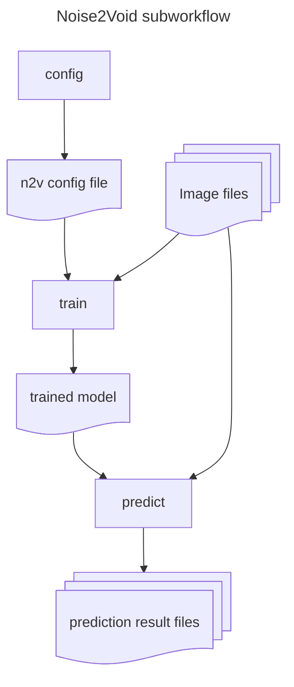

# hackathon_leuven_2024

## Image analysis nf-core module incubator

### InstantSeg

**links**
- [nf-core issue](https://github.com/nf-core/modules/issues/7152)
- Assignee: [@migueLib](https://github.com/migueLib)

### CAREamics modules & subworkflow plan

**links**
- [nf-core issue](https://github.com/nf-core/modules/issues/7157)
- [forked nf-core/modules repo for developing CAREamics modules and subworkflows](https://github.com/CAREamics/nf-core-modules)

We will create three CAREamics modules, that can be composed into CAREamics subworkflows for each of the algorithms implemented in CAREamics (Noise2Void, Noise2Noise and CARE). 

The motivation for this layout is: the subworkflows will allow users to easily include a CAREamics algorithm in their pipeline, but if they want to have more control over, for example, the subset of data used for training they can also use the CAREamics modules directly. This also adheres to the idea that modules should be atomic as possible.

The three modules will correspond to the three commands in the CAREamics CLI, namely:

- `train`: Trains a CAREamics model on given input data.
- `predict`: Takes a trained CAREamics model and creates inference results from given input data.
- `config`: Creates a CAREamics configuration file, that determines which alogrithm will be used during training.

The following schematic illustrates how the CAREamics Noise2Void subworkflow will use the CAREamics modules.

### nf-core module for Palom using custom CLI
**links**
- [nf-core issue](https://github.com/nf-core/modules/issues/7165)
- [Tool repository](https://github.com/labsyspharm/palom)

Palom is a whole-slide registration tool that registers multi-channel 2D TIFF and OME-TIFF images. Using a custom CLI wrapper provided in the module's `resources/usr/bin` subdirectory, Palom can be applied on an image list and produces a multi-channel pyramidal OME-TIFF containing both the reference image and all registered moving images.

#### Optional parameter documentation improvement ideas

[Proposal 1](https://github.com/vib-bic-code/hackathon_leuven_2024/blob/1257e5c1e600cdeae6ab9a8e3359af13657d19f6/modules/vib/palom/meta.yml#L48):
- add an additional section in meta.yml with optional parameters, describing the most important ones in detail, including data type.
- this approach would have to be discussed in nf-core whether it would be acceptable
- in general, having a way to define parameters on a module level, that would be expanded to the pipeline level, would be important

[Proposal 2](https://github.com/vib-bic-code/hackathon_leuven_2024/blob/1257e5c1e600cdeae6ab9a8e3359af13657d19f6/modules/vib/palom/tests/nextflow.config#L3):
- describe the parameters in detail in a comment block in the nextflow.config of the test for the module where some parameters might anyway be written.

[Proposal 3](https://github.com/vib-bic-code/hackathon_leuven_2024/blob/1257e5c1e600cdeae6ab9a8e3359af13657d19f6/modules/vib/palom/tests/nextflow.config#L13):
- in addition to either Proposal 1 or 2 where the parameters are described, provide an example of how the arguments / parameters would be passed to the module in a clear way

## Tutorials

During the hackathon we learned and tried many things, those include:

- [How to use existing Nextflow image analysis modules and subworkflows](nextflow_for_dummies/how_to_include_nextflow_modules_and_subworkflows.md)
- [How to create an nf-core module](https://shy-cold-a09.notion.site/Make-an-NF-Core-module-da38fe5fdc534f1d8432f63b3832f10c?pvs=74)

## Slides

We also had some nice presentations.
- [MCMICRO](./presentations/slides_MCMICRO.pdf)
- [MOLKART](./presentations/slides_Molkart.pdf)
