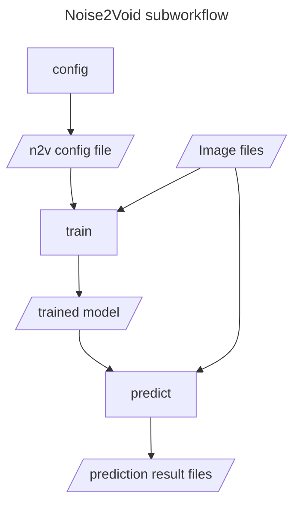

# hackathon_leuven_2024

## Tutorials

During the hackathon we learned and tried many things, those include:

- [How to use existing Nextflow image analysis modules and subworkflows](nextflow_for_dummies/how_to_include_nextflow_modules_and_subworkflows.md)
- [How to create an nf-core pipeline with an existing nf-core module step-by-step](https://github.com/vib-bic-code/hackathon_leuven_2024/blob/main/nextflow_for_dummies/create_new_nf-core_pipeline.md)
- [How to create an nf-core module](https://shy-cold-a09.notion.site/Make-an-NF-Core-module-da38fe5fdc534f1d8432f63b3832f10c?pvs=74)

In the above list, please note that there is a difference between nf-core and Nextflow, where nf-core implies to use the Nextflow infrastructure in a very specific way, which initially is more complex, but, if you have large projects is probably a good idea!


## Slides

We also had some nice presentations.
- [MCMICRO](./presentations/slides_MCMICRO.pdf)
- [MOLKART](./presentations/slides_Molkart.pdf)

## Larger-than-memory image analysis in Nextflow discussion

Tong Li presented a generic solution for how to process larger-than-memory images in Nextflow.

The general idea is:

```
Input image shape metadata => List of tiles (bounding box (BB) text files)
for each BB: // parallel processing, e.g. on a HPC
    PROCESS(Image, BB) => Analysis Results (AR) for this BB (AR_BB)
Merge all AR_BB into one output for the whole input image
```

For this to work efficiently the PROCESS function must be able to lazy load and process only the part of the image that is within the BB. And, critically, the output of PROCESS must be in the global coordinates of the whole image (and not in the local coordinates of the tile). Specifically, if the output of PROCESS is an image it must be able to contain the global tile offset information (this is something we need to look into for [how to achieve this for an OME-TIFF](https://forum.image.sc/t/computational-tiling-offsets-in-ome-xml/105915)).

Below are some links to the implementation.

- [x] refactor `tiled_cellpose/spotiflow`
    - [x] https://github.com/BioinfoTongLI/modules/tree/develop/modules/sanger/bioinfotongli/generatetiles
    - [x] https://github.com/BioinfoTongLI/modules/tree/develop/modules/sanger/bioinfotongli/cellpose
- [ ] push to nf-core for review

## Image analysis nf-core module incubator

During the hackathon we started to implement several new nf-core image processing modules. 

### InstantSeg

**links**
- [nf-core issue](https://github.com/nf-core/modules/issues/7152)
- Assignee: [@migueLib](https://github.com/migueLib)

### CAREamics modules & subworkflow plan

**links**
- [nf-core issue](https://github.com/nf-core/modules/issues/7157)
- [forked nf-core/modules repo for developing CAREamics modules and subworkflows](https://github.com/CAREamics/nf-core-modules)
- Assignees: [@diyasrivas](https://github.com/diyasrivas) [@melisande-c](https://github.com/melisande-c)

**Container**
- Thank you to [@tatianawoller](https://github.com/tatianawoller) for making a container for the CAREamics module! 
- Apptainer definition file [here](careamics.def).

We will create three CAREamics modules, that can be composed into CAREamics subworkflows for each of the algorithms implemented in CAREamics (Noise2Void, Noise2Noise and CARE). 

The motivation for this layout is: the subworkflows will allow users to easily include a CAREamics algorithm in their pipeline, but if they want to have more control over, for example, the subset of data used for training they can also use the CAREamics modules directly. This also adheres to the idea that modules should be atomic as possible.

The three modules will correspond to the three commands in the CAREamics CLI, namely:

- `train`: Trains a CAREamics model on given input data.
- `predict`: Takes a trained CAREamics model and creates inference results from given input data.
- `config`: Creates a CAREamics configuration file, that determines which alogrithm will be used during training.

The following schematic illustrates how the CAREamics Noise2Void subworkflow will use the CAREamics modules.



### nf-core module for Palom using custom CLI
**links**
- [nf-core issue](https://github.com/nf-core/modules/issues/7165)
- [Tool repository](https://github.com/labsyspharm/palom)

Palom is a whole-slide registration tool that registers multi-channel 2D TIFF and OME-TIFF images. Using a custom CLI wrapper provided in the module's `resources/usr/bin` subdirectory, Palom can be applied on an image list and produces a multi-channel pyramidal OME-TIFF containing both the reference image and all registered moving images.

**Optional parameter documentation improvement ideas**

[Proposal 1](https://github.com/vib-bic-code/hackathon_leuven_2024/blob/1257e5c1e600cdeae6ab9a8e3359af13657d19f6/modules/vib/palom/meta.yml#L48):
- add an additional section in meta.yml with optional parameters, describing the most important ones in detail, including data type.
- this approach would have to be discussed in nf-core whether it would be acceptable
- in general, having a way to define parameters on a module level, that would be expanded to the pipeline level, would be important

[Proposal 2](https://github.com/vib-bic-code/hackathon_leuven_2024/blob/1257e5c1e600cdeae6ab9a8e3359af13657d19f6/modules/vib/palom/tests/nextflow.config#L3):
- describe the parameters in detail in a comment block in the nextflow.config of the test for the module where some parameters might anyway be written.

[Proposal 3](https://github.com/vib-bic-code/hackathon_leuven_2024/blob/1257e5c1e600cdeae6ab9a8e3359af13657d19f6/modules/vib/palom/tests/nextflow.config#L13):
- in addition to either Proposal 1 or 2 where the parameters are described, provide an example of how the arguments / parameters would be passed to the module in a clear way

#### Using a custom script in a module

In the module's directory, create `resources/usr/bin` and place your script with a CLI. Make sure your script has a shebang line and is called as a command in the process script block. When this module is used, `nextflow.enable.moduleBinaries = true` needs to be added to the config file. See [nextflow documentation](https://www.nextflow.io/docs/latest/module.html#module-binaries) for more info. 

Note that this feature requires the use of a local or shared file system for the pipeline work directory. This means that the feature isn't compatible with executing your pipeline in the cloud by default, unless you're using wave containers when using cloud-based executors.  


To add tests to such modules, in the `main.nf.test`, a config file containing the above specification needs to be pointed to with [`config ./nextflow.config`](https://github.com/vib-bic-code/hackathon_leuven_2024/blob/c9b4db87b4d37c3bf986cb584cdfe8a73ffcf8b5/modules/vib/palom/tests/main.nf.test#L5)

An example implementation of this feature was worked out for the [palom](modules/vib/palom/) module.

### Wrapping BIAFLOWS QC modules

Started wrapping BIALFLOWS QC steps into module:
    
- WIP: python level changes required (https://github.com/Neubias-WG5/biaflows-utilities/issues/2).
- TODO: Submit datasets with ground truth to some public repo, e.g. Sanger S3(?)

### VALIS registration module
- [ ] Wrap VALIS image registration into module. PR to be created

### Wrapping image data conversion tools as nf-core modules

**Link to the repository:**
- https://github.com/Euro-BioImaging/bfflow
- Assignees: [@bugraoezdemir](https://github.com/bugraoezdemir), [@tatianawoller](https://github.com/tatianawoller)

**Status by the end of the hackathon:**

[bfconvert](https://bio-formats.readthedocs.io/en/stable/users/comlinetools/conversion.html), the command line tool to convert images from proprietary formats to OME-TIFF, has been wrapped as an nf-core module. Following tests have been performed and passed:
* Execution on the single machine
* Execution on the cluster using Slurm
* Saving the output to a private s3 bucket

[bioformats2raw](https://github.com/glencoesoftware/bioformats2raw), the command line tool to convert images from proprietary formats to OME-Zarr, is in the process of being wrapped as an nf-core module. 

**TODO**
* Finish wrapping bioformats2raw
* Wrap an aggregative conversion module (concatenates images along specified dimensions)
* Push the modules to nf-core


### Video to ome-tiff conversion

Use [FFmpeg](https://ffmpeg.org/) to output each frame as a TIFF file then combine them into a multipage TIFF file including OME metadata.

Initial idea was to have both frame extraction and combination steps as two processes of the module. However, we could also use the bfflow module described above for the second step.

Considerations:

FFmpeg has lots of parameters and combination/order isn't fixed which can be an issue for constructing the command line in the module. For now, we will work with a narrow use case.
We also need a source of OME metadata. This will most likely take the form of a companion metadata file.

	* Input:
		- limit input to "standard" AVI files with YUV pixel format as produced by the lab cameras we've been dealing with.
		- Parameter to downsample frame rate.
		- As placeholder for OME metadata,For now, use a parameter to require pixel size information in micrometer (otherwise need to also specify unit).

	* Output:
		- lzw-compressed grayscale multipage OME-TIFF file

**Status by the end of the hackathon:**

A module wrapping ffmpeg but not fully nf-core compliant.

**TODO*
	- Make nf-core compliant
	- Look into using bfflow
